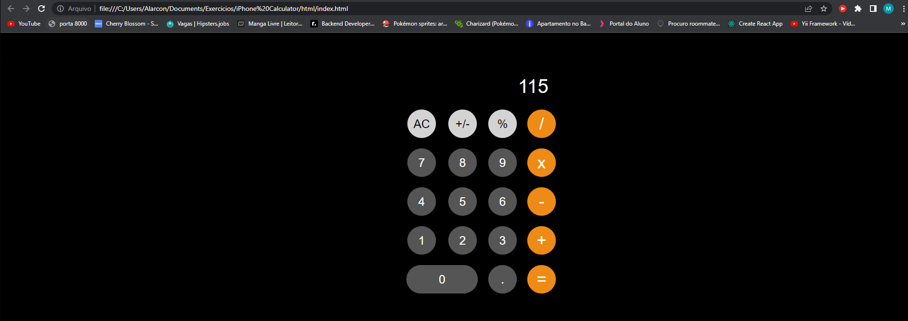

# iOS-Calculator
A clone of an iPhone calculator using HTML, CSS and JS.

I made this simple clone of the iPhone calculator app using HTML, CSS and vanilla Javascript for practicing purposes.

If you wish to test aswell, all you need to do is open the index.html file wich you can find inside the html folder after you downloaded the folder with all the files.

